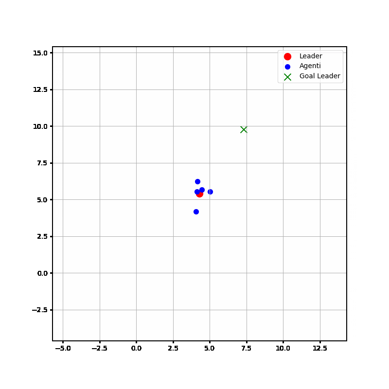
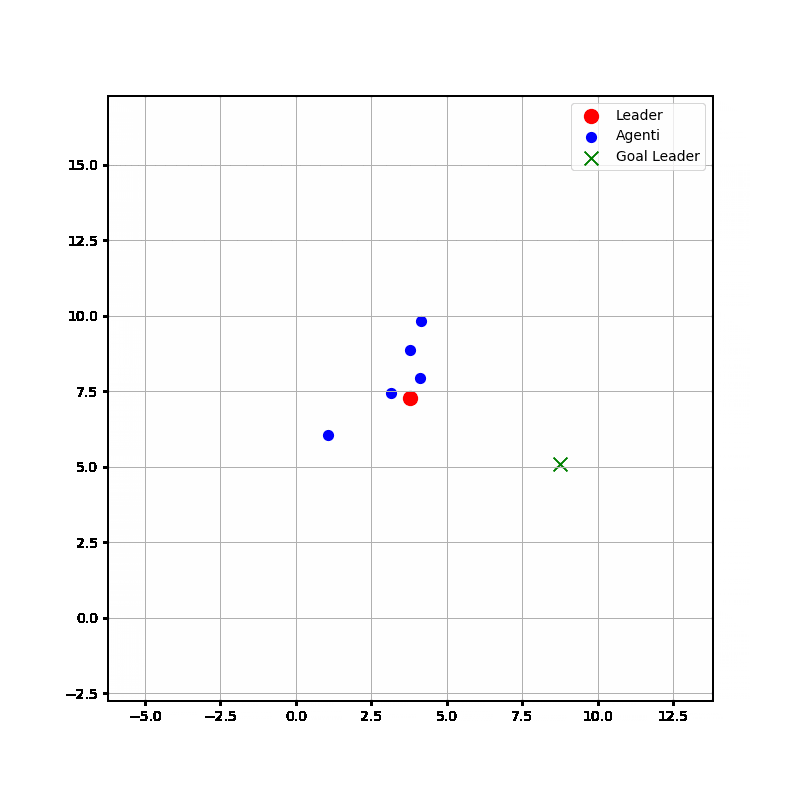

# 🌟 **Formation Control with Leader** 🌟  

## 🔍 **Analysis and Implementation of Multi-Agent Systems Based on Potentials**  
This repository contains the notebook **"Formation Control with Leader"**, a detailed analysis and implementation of multi-agent systems based on potentials. The notebook guides through the development of a formation control system for a leader and a group of agents that maintain a circular arrangement around the leader.  

---  

## 🛠️ Project Description  
The project simulates a multi-agent system that includes:  
- **🤖 Leader:** A guiding agent that moves toward a goal following an attractive potential.  
- **🌀 Agents:** A group of N agents that maintain a circular formation around the leader using a formation potential.    

### 🎯 **Main Objectives**  
- **🚩 Leader Control:** Directing the leader toward a fixed goal.  
- **⚙️ Formation Maintenance:** Ensuring that non-leader agents respect the desired arrangement.  
- **🔒 Robustness:** Testing the stability of the formation even with a moving goal (at a constant speed).  
- **📊 Performance Analysis:** Calculating the maximum goal velocity that allows the formation to remain intact.  

### 🧲 **Main Potentials Used**  
- **Attractive Potential**: Directs the leader toward the goal.  
- **Formation Potential**: Forces agents to maintain formation relative to the leader.  

---  

## 📂 Project Structure  
🔸 **Main Notebook:**  
Contains Python code with step-by-step explanations. It uses the following libraries:  
- 🧮 `numpy` for numerical computations.  
- 📈 `matplotlib` for visualization.  

🔸 **Parameter Tuning:**  
Demonstrates how to optimize potential parameters to ensure robustness and stability.  

---  

## 🎥 **Results Information**  
Since the plots in the notebook are static, GIFs are generated during execution using `matplotlib.animation`, allowing for a dynamic visualization of agent movements.  

---  

## 💡 **Contributions**  
This project was developed by **Giovanni Stefanini** as part of an analysis on multi-agent formation control for the Multiagent Systems exam.  

